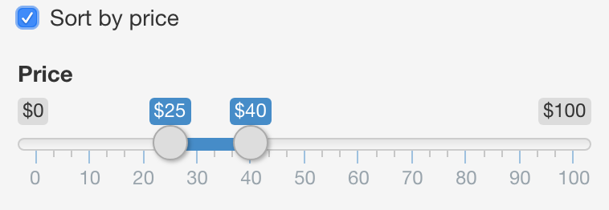
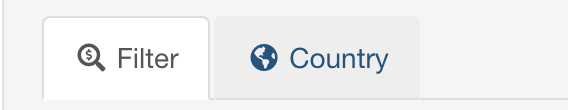

-   [STAT 545A Homework 08 Repo owned by Ziqiang Tang](#stat-545a-homework-08-repo-owned-by-ziqiang-tang)
    -   [Overview](#overview)
    -   [Feature 1](#feature-1)
    -   [Feature 2](#feature-2)
    -   [Feature 3](#feature-3)
    -   [References](#references)
    -   [Here is my previous homework if you are interested](#here-is-my-previous-homework-if-you-are-interested)
    -   [It's would be very kind if you could give me some **comments**.](#its-would-be-very-kind-if-you-could-give-me-some-comments.)

STAT 545A Homework 08 Repo owned by Ziqiang Tang
================================================

Overview
--------

This assignment is to modify the shiny app called "BC Liquor store prices", which is originally developed by [Dean Attali](https://github.com/daattali/shiny-server/tree/master/bcl), and the data is retrieved from [OpenDataBC](https://www.opendatabc.ca/dataset/bc-liquor-store-product-price-list-current-prices).

My repository is structured as follows:

| Documents                                                                                  | Description                                                                  |
|--------------------------------------------------------------------------------------------|------------------------------------------------------------------------------|
| [README.md](https://github.com/STAT545-UBC-students/hw08-ziqiangt/blob/master/README.md)   | the markdown file for homework 7                                             |
| [README.rmd](https://github.com/STAT545-UBC-students/hw08-ziqiangt/blob/master/README.Rmd) | the R-markdown file for homework 7                                           |
| [ziqiang's modified app](https://ziqiangt.shinyapps.io/BC_liquor_app/)                     | the modified app deployed online on [shinyapps.io](http://www.shinyapps.io/) |
| [bcl](https://github.com/STAT545-UBC-students/hw08-ziqiangt/tree/master/bcl)               | the folder for "BC Liquor store prices" app                                  |
| [data](https://github.com/STAT545-UBC-students/hw08-ziqiangt/tree/master/bcl/data)         | the folder for dataset                                                       |
| [www](https://github.com/STAT545-UBC-students/hw08-ziqiangt/tree/master/bcl/www)           | the folder for app's logo                                                    |
| Other                                                                                      | Other files such a .Rproj and .gitignore                                     |

Feature 1
---------

\*\* Add an option to sort the results table by price. You need to enabel the "sort by price" function by confirming the button showns as below.\*\*

Feature 2
---------

\*\* Add an image of the BC Liquor Store to the UI.\*\*

An `.gif` is added in the welcome tab.

Feature 3
---------

\*\* Place the plot and the table in separate tabs.\*\*

References
----------

-   [Dean Attali's tutorial](http://deanattali.com/blog/building-shiny-apps-tutorial/)
-   [Rdocumentation](https://www.rdocumentation.org/)
-   [Icons](http://fontawesome.io/icons/)

Here is my previous homework if you are interested
--------------------------------------------------

-   You can click to go to my homework solutions
    -   homework01
        -   [homework01 solution](https://github.com/STAT545-UBC-students/hw01-ziqiangt)
    -   homework02
        -   [homework02 solution](https://github.com/STAT545-UBC-students/hw02-ziqiangt)
    -   homework03
        -   [homework03 solution](https://github.com/STAT545-UBC-students/hw03-ziqiangt)
    -   homework04
        -   [homework04 solution](https://github.com/STAT545-UBC-students/hw04-ziqiangt)
    -   homework05
        -   [homework05 solution](https://github.com/STAT545-UBC-students/hw05-ziqiangt)
    -   homework06
        -   [homework06 solution](https://github.com/STAT545-UBC-students/hw06-ziqiangt)
    -   homework07
        -   [homework07 solution](https://github.com/STAT545-UBC-students/hw07-ziqiangt)

It's would be very kind if you could give me some **comments**.
---------------------------------------------------------------

**[homework08 Comments](https://github.com/STAT545-UBC-students/hw08-ziqiangt/issues)**
